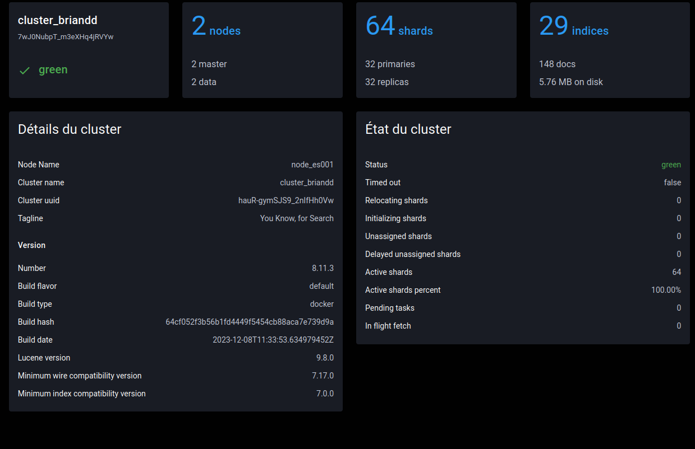
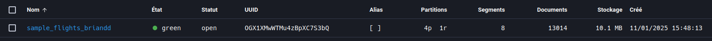
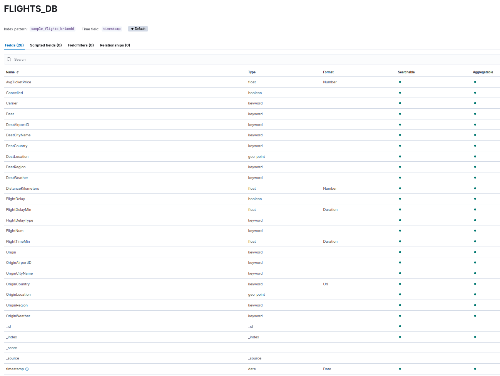
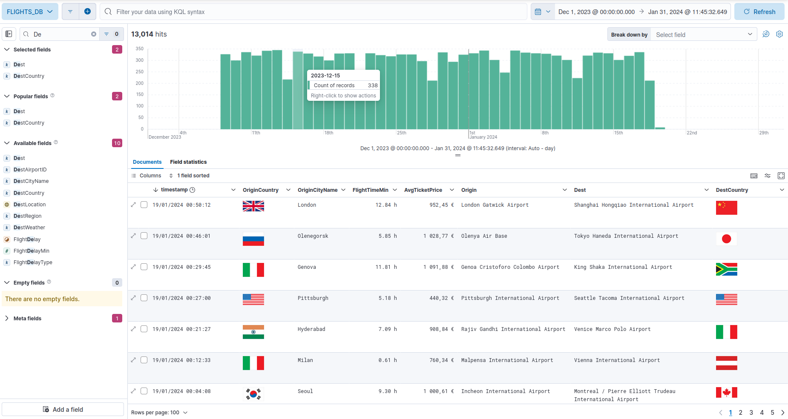
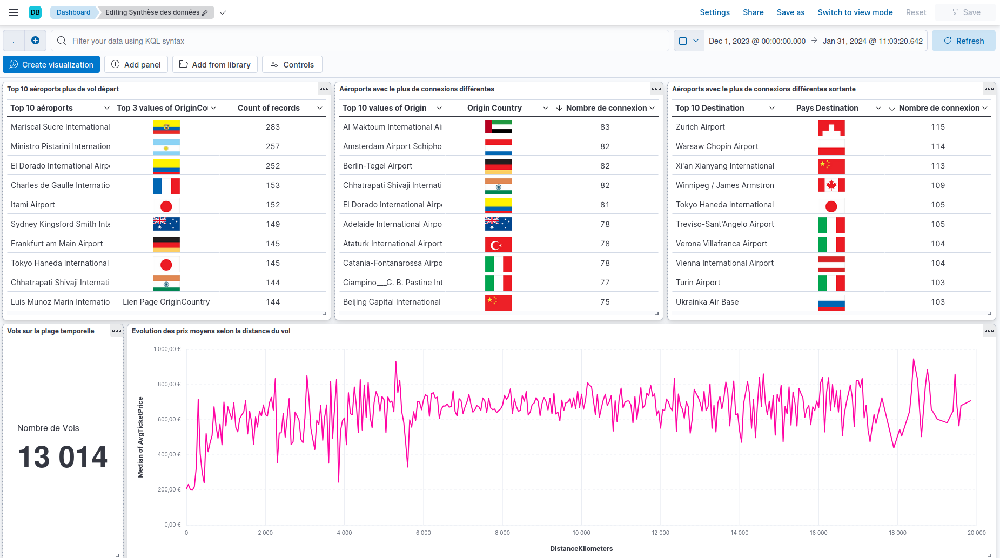
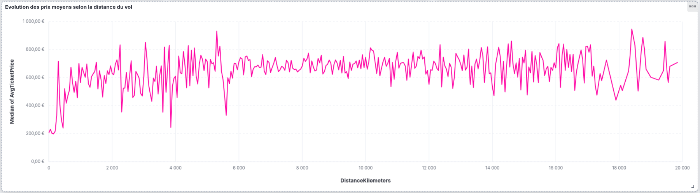
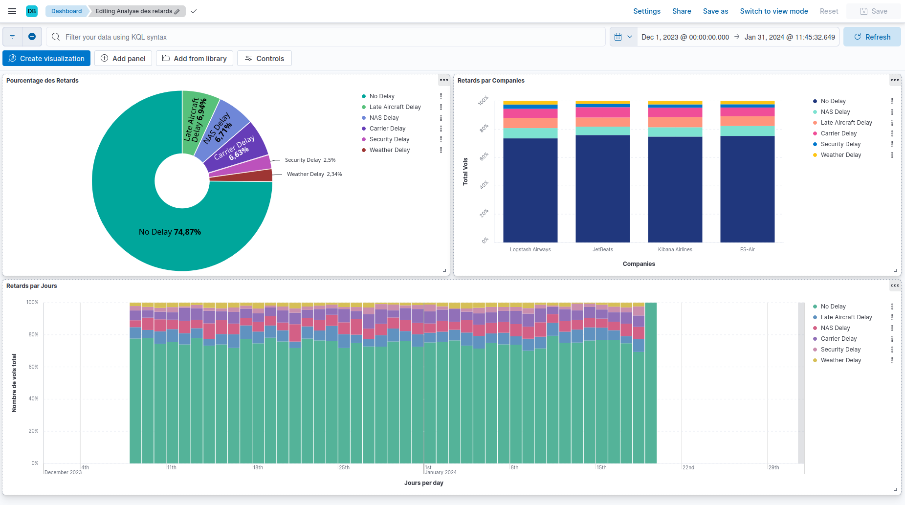
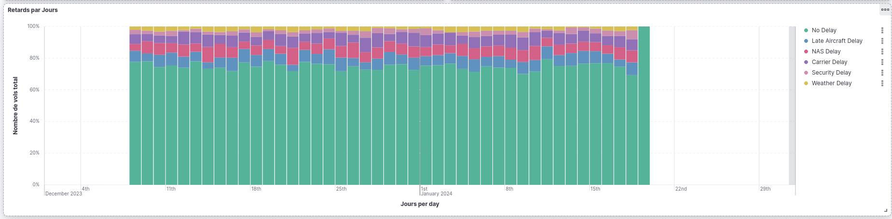
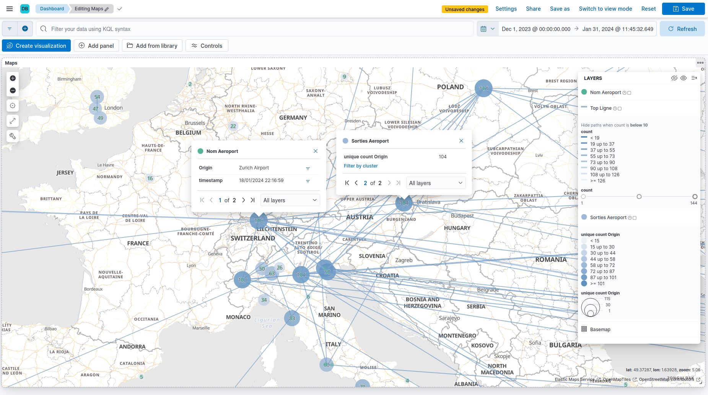

Damien BRIAND 
GROUPE : A12

# Introduction
Ce projet a pour but de mettre en place un environnement Elastic Stack pour l'analyse de données de vols aériens. Les données sont issues du jeu de données "Sample Flights" de Kibana.

Cela va étre utile pour les compagnies aériennes et les aéroports pour analyser les données de leurs vols et prendre des décisions en conséquence.

# Mise en place stack en local
```yaml
version: '3'

services:
  es001:
    image: elasticsearch:8.11.3
    container_name: conteneur_es001
    environment:
      - node.name=node_es001
      - cluster.name=cluster_briandd
      - cluster.initial_master_nodes=node_es001,node_es002
      - discovery.seed_hosts=conteneur_es002
      - xpack.security.enabled=false
      - "ES_JAVA_OPTS=-Xms512m -Xmx512m"
    ports:
      - 9200:9200

  es002:
    image: elasticsearch:8.11.3
    container_name: conteneur_es002
    environment:
      - node.name=node_es002
      - cluster.name=cluster_briandd
      - cluster.initial_master_nodes=node_es001,node_es002
      - discovery.seed_hosts=conteneur_es001
      - xpack.security.enabled=false
      - "ES_JAVA_OPTS=-Xms512m -Xmx512m"
    ports:
      - 9201:9200

  kibana000:
    image: kibana:8.11.3
    container_name: conteneur_kibana000
    depends_on:
      - es001
      - es002
    environment:
      - SERVERNAME=kibana_local
      - ELASTICSEARCH_HOSTS=http://conteneur_es001:9200
      - "ES_JAVA_OPTS=-Xms512m -Xmx512m"
    ports:
      - 5601:5601
```



## Mapping

Dans elasticVue REST : PUT `sample_flights_briandd/_mapping`
```json
{
  "properties": {
    "FlightNum": { "type": "keyword" },
    "DestCountry": { "type": "keyword" },
    "OriginWeather": { "type": "keyword" },
    "OriginCityName": { "type": "keyword" },
    "AvgTicketPrice": { "type": "float" },
    "FlightDelay": { "type": "boolean" },
    "DestWeather": { "type": "keyword" },
    "Dest": { "type": "keyword" },
    "FlightDelayType": { "type": "keyword" },
    "OriginCountry": { "type": "keyword" },
    "DistanceKilometers": { "type": "float" },
    "timestamp": { "type": "date" },
    "DestLocation": { "type": "geo_point" },
    "DestAirportID": { "type": "keyword" },
    "Carrier": { "type": "keyword" },
    "Cancelled": { "type": "boolean" },
    "FlightTimeMin": { "type": "float" },
    "Origin": { "type": "keyword" },
    "OriginLocation": { "type": "geo_point" },
    "DestRegion": { "type": "keyword" },
    "OriginAirportID": { "type": "keyword" },
    "OriginRegion": { "type": "keyword" },
    "DestCityName": { "type": "keyword" },
    "FlightDelayMin": { "type": "float" }
  }
}
```



## Peuplement
Commande d'insertion
```bash
curl localhost:9200/sample_flights_briandd/_bulk \
  -X POST \
  -H "Content-Type: application/json" \
  --data-binary @sample_flights_data.json
```

# Exploration des données par requêtes

1) Quel est le nom de la compagnie aérienne qui s’est occupée du vol numéro “U95ZN76” ?
```json
GET /sample_flights_briandd/_search
{
  "query": {
    "term": {
      "FlightNum": "U95ZN76"
    }
  },
  "_source": ["Carrier"]
}
```
- Réponse :
```json
"_source": {
    "Carrier": "Kibana Airlines"
}
```

2) Combien de vols avaient un temps ensoleillé au départ et à l’arrivée (“Sunny”), mais ont quand même eu un retard lié à la météo ?
```json
GET /sample_flights_briandd/_count
{
  "query": {
    "bool": {
      "must": [
        { "term": { "OriginWeather": "Sunny" } },
        { "term": { "DestWeather": "Sunny" } },
        { "term": { "FlightDelayType": "Weather Delay" } }
      ]
    }
  }
}
```
- Réponse : **12 vols**


3) Quels sont les numéros des 3 vols qui ont fait un trajet de la France aux USA entre le 8 et le 10 janvier 2024 (inclus) ?
```json
GET /sample_flights_briandd/_search
{
  "query": {
    "bool": {
      "must": [
        { "term": { "OriginCountry": "FR" } },
        { "term": { "DestCountry": "US" } },
        {
          "range": {
            "timestamp": {
              "gte": "2024-01-08",
              "lte": "2024-01-10"
            }
          }
        }
      ]
    }
  },
  "sort": [
    { "timestamp": "asc" }
  ],
  "_source": ["FlightNum"],
  "size": 3
}
```

- Réponse : 
```json
{
  "hits": {
    "total": {
      "value": 3,
      "relation": "eq"
    },
    "max_score": null,
    "hits": [
      {
        "_index": "sample_flights_briandd",
        "_id": "AfrhX5QBXYf1TpqvxTIJ",
        "_score": null,
        "_source": {
          "FlightNum": "TLTKOGK"
        },
        "sort": [
          1704715675000
        ]
      },
      {
        "_index": "sample_flights_briandd",
        "_id": "BfrhX5QBXYf1TpqvxTQJ",
        "_score": null,
        "_source": {
          "FlightNum": "XN4R38U"
        },
        "sort": [
          1704832735000
        ]
      },
      {
        "_index": "sample_flights_briandd",
        "_id": "-_rhX5QBXYf1TpqvxTQJ",
        "_score": null,
        "_source": {
          "FlightNum": "L4B4GPZ"
        },
        "sort": [
          1704897784000
        ]
      }
    ]
  }
}
```

4) Quels sont les numéros et les villes de destination des 5 vols des compagnies autres que “Logstash Airways” qui ont fait France - Canada sur toute la période des données ?
```json
GET /sample_flights_briandd/_search
{
  "query": {
    "bool": {
      "must": [
        { "term": { "OriginCountry": "FR" } },
        { "term": { "DestCountry": "CA" } }
      ],
      "must_not": {
        "term": { "Carrier": "Logstash Airways" }
      }
    }
  },
  "_source": ["FlightNum", "DestCityName"],
  "size": 5
}
```

- Réponse : 
1- FlightNum: **PYK4TVQ**, DestCityName: **Winnipeg**
2- FlightNum: **XH9H5H3**, DestCityName: **Edmonton**
3- FlightNum: **MUFJ77J**, DestCityName: **Edmonton**
4- FlightNum: **0G503MR**, DestCityName: **Edmonton**
5- FlightNum: **V1TCR2A**, DestCityName: **Edmonton**

5) Quels sont les numéros de vol et le nom de l’aéroport de départ des 2 vols  qui sont partis à moins de 50 km du London Eye (Latitude = 51.5034 / Longitude = -0.1195) le 09/12/2023 entre 9H et 15H ?
```json
GET /sample_flights_briandd/_search
{
  "query": {
    "bool": {
      "must": [
        {
          "geo_distance": {
            "distance": "50km",
            "OriginLocation": {
              "lat": 51.5034,
              "lon": -0.1195
            }
          }
        },
        {
          "range": {
            "timestamp": {
              "gte": "2023-12-09T09:00:00",
              "lte": "2023-12-09T15:00:00"
            }
          }
        }
      ]
    }
  },
  "_source": ["FlightNum", "Origin"],
  "size": 2
}
```

- Réponse :
1- FlightNum: **BGW87E2**, Origin: **London Luton Airport**
2- FlightNum: **1A5EKSQ**, Origin: **London Heathrow Airport**

6) Quels sont les noms des 4 différentes compagnies aériennes présentes en base, avec le nombre de vols par compagnie ?
```json
GET /sample_flights_briandd/_search
{
  "size": 0,
  "aggs": {
    "carriers": {
      "terms": {
        "field": "Carrier",
        "size": 4
      }
    }
  }
}
```

- Réponse :
1- "key": Logstash Airways, doc_count: **3323**
2- "key": JetBeats,         doc_count: **3261**
3- "key": Kibana Airlines,  doc_count: **3219**
4- "key": ES-Air,           doc_count: **3211**

7) Quels sont les noms des 4 différentes villes de départ des vols qui décollent depuis l’Allemagne ?
```json
GET /sample_flights_briandd/_search
{
  "query": {
    "match": {
      "OriginCountry": "DE"
    }
  },
  "size": 0,
  "aggs": {
    "originCities": {
      "terms": {
        "field": "OriginCityName",
        "size": 4
      }
    }
  }
}
```

- Réponse :
    - Frankfurt am Main
    - Berlin
    - Cologne
    - Munich

8) Combien de vols correspondent aux 3 plages suivantes ?
- Aucun retard (**9744** vols sont dans ce cas)
- Retard de [1, 60[ min (**412** vols sont dans ce cas)
- Retard de 60 min ou plus (**2858** vols sont dans ce cas)
```json
GET /sample_flights_briandd/_search
{
  "size": 0,
  "aggs": {
    "flight_delays": {
      "range": {
        "field": "FlightDelayMin",
        "ranges": [
          { "to": 1, "key": "Aucun retard" },
          { "from": 1, "to": 60, "key": "Retard de [1, 60[ min" },
          { "from": 60, "key": "Retard de 60 min ou plus" }
        ]
      }
    }
  }
}
```

- Réponse : 
    - Aucun retard : **9744** vols
    - Retard de [1, 60[ min : **412** vols
    - Retard de 60 min ou plus : **2858** vols

# Construction de 2 Dashboards Kibana

## Parametrage

Pour que les données soit lisibles par tous il a était necéssaire de faire des paramétrage sur quelque données.

Les valeurs de **timestamp** s’affiche au format de date à la française.
Exemple pour le 1er février 2003 à 12H45 et 30sec => “01/02/2003 12:45:30”.

Les valeurs de **DistanceKilometers** s’affiche en nombre de kilomètres arrondi à l’entier.
Exemple pour 123.45678 kilomètres => “123”.

Les valeurs de **FlightTimeMin** s’affiche comme des durées précises avec 2 chiffres après la virgule et unité courte.
Exemple pour 63 minutes => “1.05 h”.

Les valeurs de **FlightDelayMin** s’affiche comme des durées approximatives avec unité.
Exemples : Pour un vol sans retard => “0 seconds”, et pour un vol avec 2.2 heures de retard => “2 hours”.

Les valeurs de **AvgTicketPrice** s’affiche comme des prix en € au format français.
Exemple pour 1234,56 => “1 234,56 €”.

Les valeurs de **OriginCountry** et **DestCountry** s'affichent sous la forme d’images de drapeaux.





## Synthèse des données



<hr>

<tr>
    <td></td>
    <td></td>
    <td></td>
    <td></td>
</tr>



## Analyse des retards



<hr>

<tr>
    <td></td>
    <td></td>
</tr>



## Map

Ce Dashboard permet de voir les aéroports, leurs nombre totaux de sortie et les lignes d'avions les plus prise de cette aéroport sur une carte intéractive.



# Conclusion

Ce projet a permis de mettre en place un environnement Elastic Stack pour l'analyse des données de vols aériens. Les analyses effectuées ont révélé des informations précieuses telles que les compagnies aériennes les plus actives, les retards de vols en fonction des conditions météorologiques, et les trajets spécifiques entre différents pays. Les tableaux de bord créés offrent une visualisation claire et interactive des données, facilitant ainsi la prise de décision pour les compagnies aériennes.

# Retour d'Expérience

J'ai appris à configurer un cluster Elasticsearch, à créer des mappings personnalisés, et à utiliser les requêtes pour extraire des informations spécifiques. 

La mise en place des tableaux de bord Kibana a été relativement facile grâce à l'interface intuitive. Globalement, Elasticsearch et Kibana sont des outils faciles à prendre en main. Cependant, les requêtes peuvent être peu intuitives et difficiles à lire.
